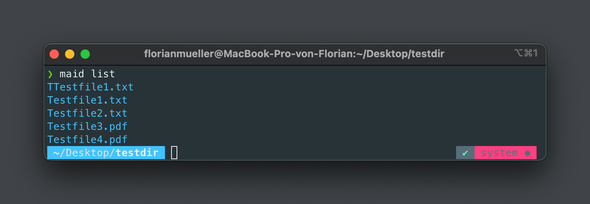
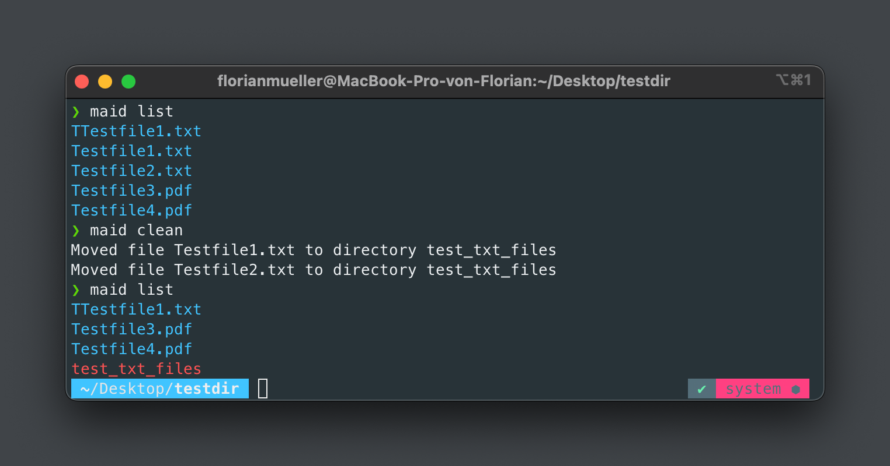
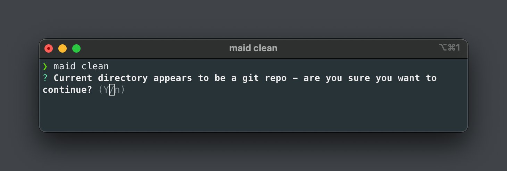

<p align="center">
  
</p>

<div align="center">
  <h1>maid-cleaning-cli</h1>
</div>

### Maid - Your Lightweight CLI Utility for Keeping Directories Clean and Structured

Organizing directories can become messy over time. Maid is here to help. Define where files should go, and Maid will take care of it. Listing files, moving files, and maintaining clean directories - Maid is here for you!

## Installation

```
npm install maid-cleaning-cli -g
```

## Usage

### Listing Contents of a Directory

To list all files and sub-directories in a certain directory, just navigate to said directory and tell maid to list:

```sh
maid list
```

The output will be color-coded. Blue represents files, and red represents sub-directories.

<p align="center">
  
</p>

To specify what to list, `list` accepts two flags:

- `-f` or `--files` to show files
- `-d` or `--dirs` to show directories

When using the flags, a color-coded headline will be printed above the actual result. Either `Directories in current directory` or `Files in current directory`.

### Cleaning a directory

To clean a directory, just simply navigate to the messy directory and tell maid to clean:

```sh
maid clean
```

By default maid will not start cleaining without you instructing what needs cleaing and what must not be cleaned. For the clean command to take action, a `.maidrc`-file is required. If no config is present, an error with instructions will be printed - so don't worry, maid won't go ahead and move your files around without you knowing what you are doing.

### Example

With the following rule in my `.maidrc`:

```yaml
---
cleanRules:
  - { pattern: "^Test", fileExtension: ".txt", dirName: "test_txt_files" }
```

Every file with a name starting with `"Test"` and a file extention of `".txt"` will be moved to a folder `test_txt_files`.

<p align="center">
  
</p>

### .maidrc Configuration

To instruct Maid on what to clean, create a `.maidrc` configuration file on your machine. Maid will use it when running.

For now, the config file only supports one property: `cleanRules`.

`cleanRules` is an array of objects that define the rules for Maid to clean. Each object represents one rule, indicating what to clean and under which conditions.

- `pattern (String)`: A regular expression to describe how the filename should look (e.g. `"^Test"` will filter all files starting with "Test")
- `fileExtension (String-Array)`: A list of file extension to limit the files to be cleaned (e.g. `".png"` - include the `.`)
- `applyInDir (String-Array)`: A list of paths in which the rule can be applied. If applyInDir is no present, the rule is global and applicable in every folder
- `dirName (String)`: When cleaning files, maid will move them to a folder, that can be specified with this string (e.g. `"/screenshots/images"`)

`pattern`, `fileExtension` and `applyInDir` will be evaluated with `AND`-logic, so the rule

```json
{
  "pattern": "^Testfile",
  "fileExtension": [".png"],
  "dirName": "testfiles",
  "applyInDir": ["/Users/<username>/Desktop"]
}
```

will only move files to a folder called `testfiles`, if the following conditions are all met:

- if the filename starts with `"Testfile"`
- if the file has the extension `.png`
- the current directory is `/Users/<username>/Desktop`

If neither `pattern` nor `fileExtension` is defined, the rule will not trigger and do nothing.

### git repo safeguard

As an additional safeguard to prevent accidentally messing up the structure of git repositories, maid has a build in check when running `clean`. If current directory is a git repository, maid will ask if you wish to continue.

<p align="center">
  
</p>

### Getting Information about Saved Configuration

To retrieve information about the saved `.maidrc` configuration, use the following command:

```sh
maid config

```

For specific information, use these flags:

- `p` or `--path`: Get the path to the config file
- `r` or `--cleanRules`: Get all saved rules from the config
- `d` or `--rulesForDir`: Get rules specific to the current directory
